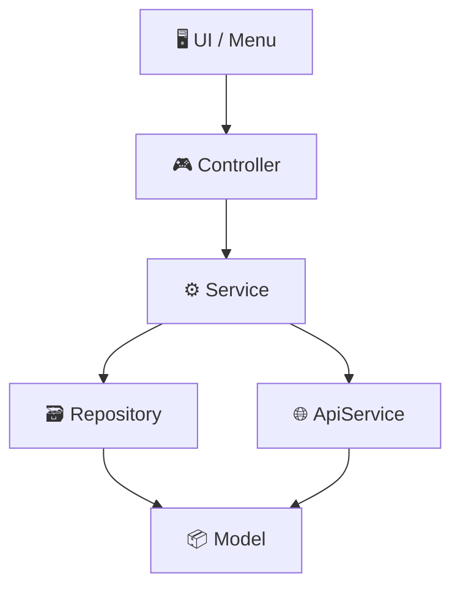
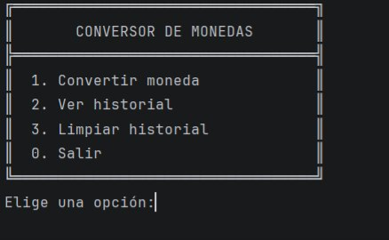
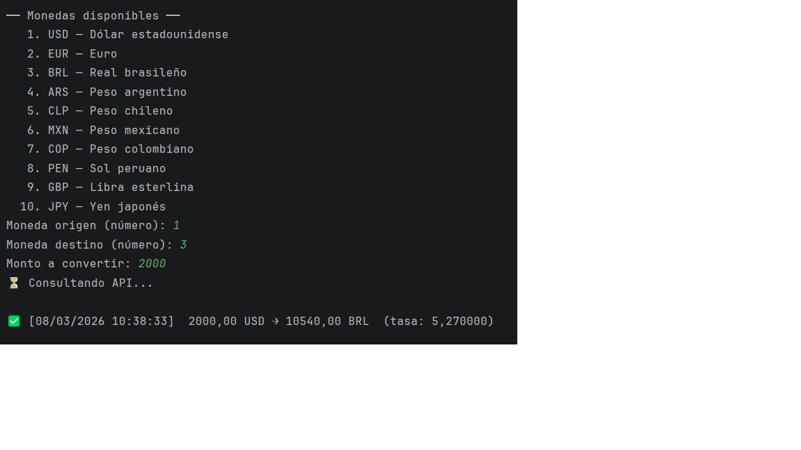
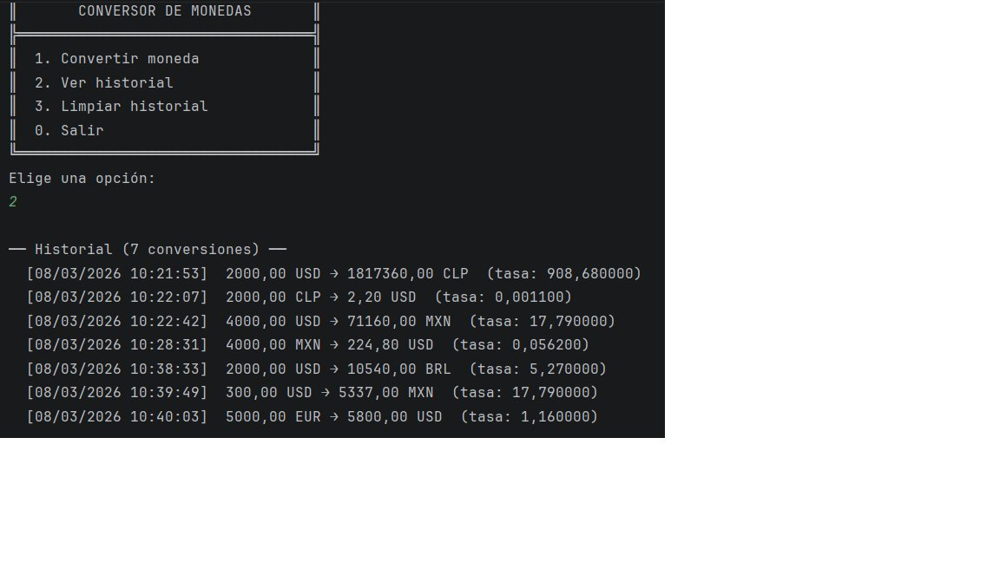
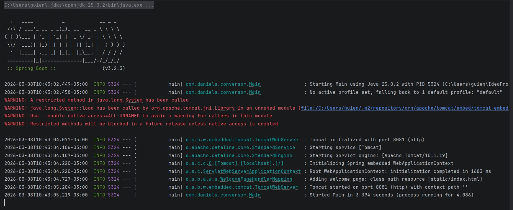
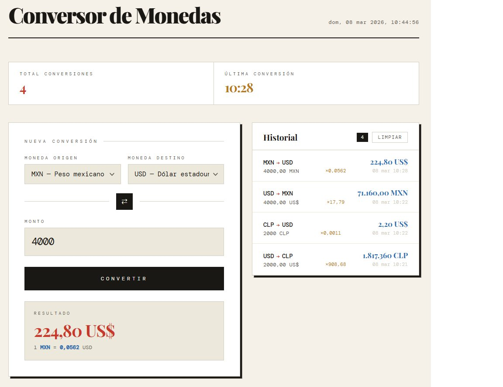

<h1 align="center"> 💱 Conversor de Monedas </h1>

<p align="center">
Aplicación de conversión de divisas en tiempo real con dos modos de ejecución: consola interactiva y frontend web, ambos conectados al mismo backend con persistencia de historial.
</p>

<p align="center">


</p>

<p align="center">
<em>Desarrollado como parte del Challenge de Alura — Backend con Java · Oracle Next Education</em>
</p>

---

## Tabla de contenidos

- [Funcionalidades](#funcionalidades)
- [Arquitectura del proyecto](#arquitectura-del-proyecto)
- [Demo](#demo)
- [Instalación y ejecución](#instalación-y-ejecución)
- [API REST](#api-rest)
- [Monedas disponibles](#monedas-disponibles)
- [Estructura del proyecto](#estructura-del-proyecto)
- [Tecnologías](#tecnologías)
- [Autor](#autor)

---

## Funcionalidades

- Conversión entre **23 monedas** con tasas en tiempo real via API
- Historial de todas las conversiones realizadas
- Marca de tiempo en cada conversión usando `java.time.LocalDateTime`
- Persistencia del historial en `historial.json` — sobrevive reinicios
- API REST con Spring Boot — endpoints `/api/convertir` y `/api/historial`
- Dos modos: consola interactiva y frontend web

---

## Arquitectura del proyecto



### Descripción de las capas

- **UI / Menu** — Maneja la interacción con el usuario desde la consola.
- **Controller** — Expone los endpoints REST y delega la lógica al Service.
- **Service** — Contiene la lógica de negocio: conversiones y consumo de la API externa.
- **Repository** — Gestiona el almacenamiento y recuperación del historial en `historial.json`.
- **Model** — Define las estructuras de datos: `Conversion` y `Moneda`.

---

## Demo

### Modo Consola

**Menú principal**



**Realizando una conversión**



**Historial con marcas de tiempo**



### Modo Web

**Servidor Spring Boot activo**



**Frontend en el navegador**



---

## Instalación y ejecución

### Requisitos previos

- Java 17 o superior → [Descargar](https://www.oracle.com/java/technologies/downloads/)
- Maven → [Descargar](https://maven.apache.org/download.cgi)

### Clonar el repositorio

```bash
git clone https://github.com/AndresMellaS/conversor-monedas.git
cd conversor-monedas
```

### Configuración

Copia el archivo de ejemplo y agrega tu API key:

```bash
cp application.properties.example src/main/resources/application.properties
```

Luego abre `src/main/resources/application.properties` y reemplaza `TU_API_KEY_AQUI` con tu key de [ExchangeRate API](https://www.exchangerate-api.com).

### Modo Web

```bash
mvn spring-boot:run
```

Luego abre tu navegador en `http://localhost:8081`

### Modo Consola

```bash
mvn spring-boot:run -Dspring-boot.run.arguments=--consola
```

O configura el argumento `--consola` directamente en IntelliJ.

---

## API REST

| Método | Endpoint | Descripción |
|--------|----------|-------------|
| `POST` | `/api/convertir` | Realiza una conversión |
| `GET` | `/api/historial` | Obtiene el historial completo |
| `DELETE` | `/api/historial` | Limpia el historial |

### Ejemplo de request

```json
POST /api/convertir
{
  "desde": "USD",
  "hasta": "BRL",
  "monto": 100
}
```

### Ejemplo de response

```json
{
  "desde": "USD",
  "hasta": "BRL",
  "monto": 100.0,
  "resultado": 527.0,
  "tasa": 5.27,
  "timestamp": "2026-03-08T10:38:33.123"
}
```

---

## Monedas disponibles

<details>
<summary>Ver las 23 monedas soportadas</summary>

| Código | Moneda |
|--------|--------|
| USD | Dólar estadounidense |
| EUR | Euro |
| BRL | Real brasileño |
| ARS | Peso argentino |
| CLP | Peso chileno |
| MXN | Peso mexicano |
| COP | Peso colombiano |
| PEN | Sol peruano |
| UYU | Peso uruguayo |
| BOB | Boliviano |
| GBP | Libra esterlina |
| JPY | Yen japonés |
| CNY | Yuan chino |
| CAD | Dólar canadiense |
| AUD | Dólar australiano |
| CHF | Franco suizo |
| INR | Rupia india |
| KRW | Won surcoreano |
| SEK | Corona sueca |
| NOK | Corona noruega |
| NZD | Dólar neozelandés |
| SGD | Dólar de Singapur |
| HKD | Dólar de Hong Kong |

</details>

---

## Estructura del proyecto

```
src/main/
├── java/com/daniels/conversor/
│   ├── Main.java
│   ├── model/
│   │   ├── Moneda.java
│   │   └── Conversion.java
│   ├── service/
│   │   ├── ApiService.java
│   │   └── ConversorService.java
│   ├── repository/
│   │   └── HistorialRepository.java
│   ├── controller/
│   │   └── ConversorController.java
│   └── util/
│       └── Menu.java
└── resources/
    ├── static/
    │   └── index.html
    └── application.properties        ← no se sube al repo (.gitignore)
```

---

## Tecnologías

| Tecnología | Uso |
|------------|-----|
| Java 17+ | Lógica de negocio y backend |
| Spring Boot 3.2.3 | Servidor web y API REST |
| Gson 2.10.1 | Parseo de JSON y persistencia |
| HttpClient | Consumo de API externa |
| java.time | Marcas de tiempo |
| HTML / CSS / JS | Frontend sin frameworks |

**API de tasas de cambio:** [ExchangeRate API v6](https://www.exchangerate-api.com/) — requiere registro gratuito para obtener API key.

---

## Autor

**Daniel Sepúlveda M.**

*Challenge Alura — Oracle Next Education (ONE)*
